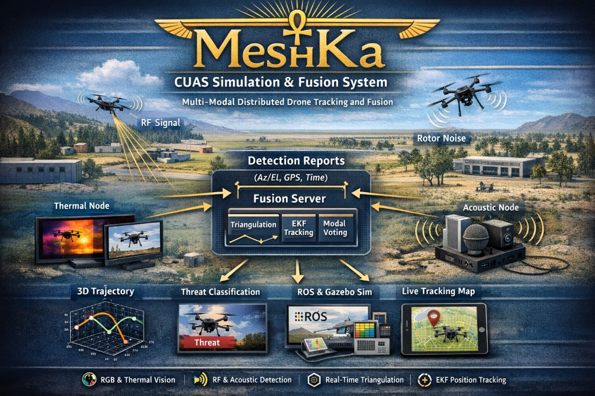

# meshkah — CUAS-SIM academic prototype



**Architecture and data flow:** see [docs/system-architecture.md](docs/system-architecture.md).

This repository implements a simulation-first quad-modal anti-drone fusion stack across five phases:

- Phase 1: message definitions, bearing triangulation, EKF tracking, virtual RGB nodes
- Phase 2: Gazebo + ArduPilot SITL integration bridge
- Phase 3: real RGB + thermal detection pipelines
- Phase 4: RF + acoustic modalities and confidence-weighted modal vote
- Phase 5: LoRa transport abstraction with JSON serialization and preflight checks

## Layout

```
meshkah/
  src/
    cuas_msgs/
    node_sim/
    fusion/
    metrics/
    sim_world/
  launch/
  scripts/
  tests/
  requirements.txt
```

## Environment

- Windows 11 host, WSL2 Ubuntu 24.04
- ROS 2 Jazzy
- Gazebo Harmonic
- Python 3.12

---

## Build

ROS message generation runs **`rosidl_parser`**, which imports **`lark`**. If that module is missing, `cuas_msgs` fails with `ModuleNotFoundError: No module named 'lark'`.

Install it for **system Python** (what `/usr/bin/python3` uses when ROS runs generators):

```bash
sudo apt update
sudo apt install -y python3-lark python3-catkin-pkg
```

If you use a **Python venv** (`.venv`), `colcon` may also use that interpreter for some `ament` steps. Keep the venv aligned with ROS build needs:

```bash
cd ~/meshkah
source /opt/ros/jazzy/setup.bash
source .venv/bin/activate
pip install -U pip catkin_pkg lark
rosdep install --from-paths src --ignore-src -r -y
colcon build
source install/setup.bash
```

Alternative (no venv during build): `deactivate` before `colcon build`, then activate `.venv` again when running tests or GPU nodes.

Build only messages:

```bash
colcon build --packages-select cuas_msgs
```

---

## Python runtime for ROS nodes

Console scripts (`fusion_node`, `evaluator`, etc.) get their **`#!/.../python3` shebang from the Python that runs `setup.py install` during the build.** That is usually the same interpreter as your **`colcon`** command.

**Common pitfall:** `.venv` is active and has `filterpy`, but **`colcon` is still `/usr/bin/colcon`** (system). Then the build uses **`/usr/bin/python3`** for installs, and nodes crash with `ModuleNotFoundError` for venv-only packages.

**Fix (recommended if you use `.venv`):** install `colcon` inside the venv and build with that `colcon`:

```bash
cd ~/meshkah
source .venv/bin/activate
pip install -U colcon-common-extensions
which colcon   # must show .../meshkah/.venv/bin/colcon
source /opt/ros/jazzy/setup.bash
colcon build
source install/setup.bash
```

Or run the helper script (does the same checks):

```bash
chmod +x scripts/build_in_venv.sh
./scripts/build_in_venv.sh
```

Verify after a build:

```bash
head -n 1 install/fusion/lib/fusion/fusion_node
```

You should see your `.venv/bin/python3` in the shebang if you want venv runtime.

**Alternative:** keep system `colcon` and system runtime: `deactivate`, then `python3 -m pip install --break-system-packages filterpy` (and use `apt` for numpy/scipy as needed).

---

## Run Phase 1 (headless, no Gazebo)

Headless: virtual RGB sensors, synthetic drone truth, fusion, evaluator.

```bash
ros2 launch "$(pwd)/launch/phase1.launch.py"
```

---

## Run Full 3D Integrated Scenario — 3 Terminals

Open **three WSL2 terminals** side by side. Run them in order: Terminal 1 starts everything, Terminal 2 attaches the MAVProxy GUI, Terminal 3 is for monitoring and visualization.

---

### Prerequisites — confirm before starting

```bash
ls ~/ardupilot_gazebo/build/libArduPilotPlugin.so   # Gazebo plugin
ls ~/ardupilot/Tools/autotest/sim_vehicle.py         # SITL
ls /opt/ros/jazzy/share/ros_gz_bridge                # ros_gz_bridge
ls ~/meshkah/install/setup.bash  # built workspace
```

If anything is missing, install first:

```bash
cd ~/meshkah
INSTALL_ROS_GZ=1 ./scripts/install_sim_stack.sh
```

---

### Terminal 1 — Full scenario (Gazebo + ROS bridge + meshkah stack + auto-fly + cinematic camera)

This one command starts everything: Gazebo world, SITL headless, ROS pose bridge, all meshkah nodes, automated drone flight (5 orbit laps), and the cinematic follow-camera.

```bash
# Source ROS and the built workspace
source /opt/ros/jazzy/setup.bash
source ~/meshkah/install/setup.bash

# Go to the workspace root
cd ~/meshkah

# Run the full scenario with auto-fly and cinematic camera enabled
USE_CINEMATIC_CAMERA=true AUTO_FLY=1 AUTO_FLY_LOOPS=5 ./scripts/start_full_scenario.sh
```

The script starts four sub-processes in order and waits for each one before proceeding:

| Step | What starts | Wait time |
|------|-------------|-----------|
| 1 | Gazebo `cuas_field.world` (clean env, no ROS) | ~12 s |
| 2 | ArduPilot SITL headless (`gazebo-iris --model JSON`) | up to 120 s (polls port 5760) |
| AUTO | `auto_fly_cuas_field.py` — arms, takes off to 15 m, orbits nodes A→B→C (5 laps) | starts after SITL ready |
| 3 | `ros_gz_bridge` — Gazebo Iris pose → `/ardupilot/vehicle_pose` | ~4 s |
| 4 | `full_sim.launch.py` — sensor nodes, fusion, EKF, evaluator, `track_viz_node`, cinematic cam controller | running |

Press **Ctrl-C** at any time to stop all sub-processes cleanly.

> **Change orbit loops:** set `AUTO_FLY_LOOPS=0` for infinite looping, or any number for a fixed count.
> **Disable auto-fly:** omit `AUTO_FLY=1` and fly manually in Terminal 2.
> **Disable cinematic camera:** omit `USE_CINEMATIC_CAMERA=true`.

---

### Terminal 2 — MAVProxy GUI (SITL console)

Open a **second WSL2 terminal**. This gives you the interactive MAVProxy console to monitor and control the drone manually if needed (even when auto-fly is running).

```bash
# Activate the ArduPilot venv
source ~/venv-ardupilot/bin/activate

# Source ROS and workspace
source /opt/ros/jazzy/setup.bash
source ~/meshkah/install/setup.bash

# Connect to the running SITL and open the MAVProxy GUI
cd ~/meshkah
./scripts/start_sitl.sh
```

Wait for Terminal 1's SITL to finish starting (port 5760 ready) before running this. You will see the MAVProxy map and console windows appear.

**Manual flight commands (type in the MAVProxy console):**

```
mode guided
arm throttle
takeoff 15
velocity 2 0 0    # move forward at 2 m/s
mode rtl          # return to home and land
```

---

### Terminal 3 — Visualization and topic monitoring

Open a **third WSL2 terminal** after Terminal 1 is running. Use this for RViz, topic checks, and the cinematic camera stream.

```bash
# Source ROS and workspace
source /opt/ros/jazzy/setup.bash
source ~/meshkah/install/setup.bash
```

**Open RViz for 3D drone tracking:**

```bash
rviz2
```

In RViz:
1. Set **Fixed Frame** to `map`.
2. **Add** → **By topic** → `/track_markers` → **MarkerArray** (drone sphere, predicted arrow, bearing rays).
3. **Add** → **By topic** → `/track_path` → **Path** (historical flight path line).

**Check topic data flow:**

```bash
ros2 topic hz /ardupilot/vehicle_pose   # Gazebo → bridge       (expect ~50 Hz)
ros2 topic hz /gazebo/drone_truth       # bridge → fusion truth  (expect ~50 Hz)
ros2 topic hz /detections               # sensor nodes           (expect ~8 Hz)
ros2 topic hz /global_track             # fusion EKF output      (expect ~20 Hz)
ros2 topic hz /track_markers            # RViz markers           (expect ~20 Hz)
```

**Inspect the fused track:**

```bash
ros2 topic echo /global_track
```

**View all running nodes:**

```bash
ros2 node list
```

**Watch evaluator metrics (printed every 5 s in Terminal 1):**

```
RMSE_pos=…m  RMSE_vel=…m/s  latency=…ms  FPR=0.000
```

**Cinematic camera stream** (requires `USE_CINEMATIC_CAMERA=true` in Terminal 1):

```bash
ros2 run rqt_image_view rqt_image_view
# Select topic: /cinematic_cam/image_raw
```

If `rqt_image_view` is missing:

```bash
sudo apt install ros-jazzy-rqt-image-view python3-pyqt5
```

---

## Unit tests

```bash
pytest tests/test_triangulation.py tests/test_ekf.py
```

---

## Simulation stack installation (first-time setup)

Install on **Ubuntu 24.04 (WSL2 or native)** as a normal user (not `sudo bash`):

```bash
cd ~/meshkah
chmod +x scripts/install_*.sh
# Required for full 3D scenario: also install ros-jazzy-ros-gz
INSTALL_ROS_GZ=1 ./scripts/install_sim_stack.sh
```

Or run steps separately:

- `scripts/install_gazebo_harmonic.sh` — Gazebo Harmonic from OSRF packages
- `scripts/install_ardupilot_sitl.sh` — clone `~/ardupilot`, prereqs, SITL build
- `scripts/install_ardupilot_gazebo.sh` — build `~/ardupilot_gazebo` plugin for Harmonic

After install, add `PATH` and `GZ_SIM_*` exports printed by the scripts to `~/.bashrc`, then follow [ArduPilot SITL with Gazebo](https://ardupilot.org/dev/docs/sitl-with-gazebo.html).

To open the meshkah **CUAS field** world alone (without SITL or ROS):

```bash
chmod +x scripts/start_gazebo_cuas_field.sh
./scripts/start_gazebo_cuas_field.sh
```

If WSL reports `bash\r: No such file or directory`, the scripts were saved with Windows CRLF. From WSL, fix with:

```bash
sed -i 's/\r$//' scripts/*.sh
```

---

## Notes

- Fusion window is fixed at 1.0 s
- EKF predict loop runs at 20 Hz
- Triangulation requires at least two bearing nodes
- Modal vote confirmation requires combined confidence >= 0.6 and at least two bearing modalities
- Use `ROS_DISTRO=jazzy` with `scripts/start_sim.sh` unless you intentionally target another distro
- SITL runs headless inside `start_full_scenario.sh` (no `--map`/`--console`). For the MAVProxy GUI, open a separate terminal and run `./scripts/start_sitl.sh` manually
