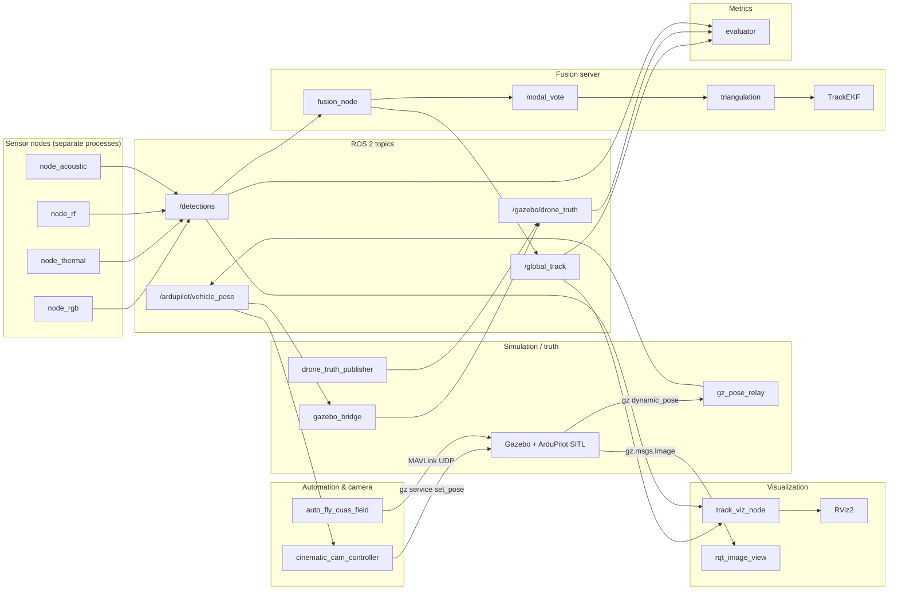

# System architecture

This document describes the **meshkah** workspace: an academic **Counter-UAS (CUAS) simulation** stack that fuses multiple sensor modalities, estimates a drone position in **ENU**, and tracks it with an **Extended Kalman Filter (EKF)**. The design targets **ROS 2 Jazzy** on **Ubuntu 24.04** (including **WSL2**), **Gazebo Harmonic**, and **ArduPilot SITL** for physics and vehicle truth.

All command examples in project docs assume the workspace root is `~/meshkah`.

---

## 1. Purpose and scope

**Goals:**

- Ingest detections from four modalities: RGB, thermal, RF, acoustic.
- Triangulate a **3D position** from **bearing-only** reports when at least two nodes supply valid azimuth and elevation.
- Maintain a **6-state EKF** (position and velocity in ENU) with a fixed **20 Hz** prediction rate.
- Compare fused output to ground truth for **RMSE**, **latency**, and **false positive** metrics.
- Support a path from **simulation** (ROS topics) to **hardware** (LoRa JSON transport).
- Provide **automated drone flight** around a sensor field for hands-free simulation runs.
- Enable **cinematic camera tracking** of the drone for visual review and recording.
- Publish **3D RViz markers** of fused tracks and sensor rays for real-time situational awareness.

**Out of scope for this document:** Detailed tuning of YOLO weights, RF physics, or production security hardening.

---

## 2. Logical architecture

The system splits into **edge sensor processes**, a **central fusion service**, **truth and simulation bridges**, **evaluation**, **visualization**, and optional **automated flight control**.



**Design rules (from project specification):**

- Each sensor node runs as its **own OS process** (separate launch entries).
- Fusion uses a **1.0 s** rolling time window for `DetectionReport` messages.
- Triangulation runs only when at least **two distinct nodes** contribute **bearing-capable** reports (RGB and thermal in the current modal vote logic).
- EKF **predict** runs at **20 Hz** regardless of measurement rate.
- **Confirmed** track threshold: modal combined confidence **≥ 0.6** with sufficient bearing modalities (see Section 6).

---

## 3. Software packages (ROS 2 workspace layout)

| Package | Role |
|---------|------|
| `cuas_msgs` | Custom messages: `DetectionReport`, `GlobalTrack` |
| `node_sim` | Detector nodes, truth publisher, Gazebo pose bridge, cinematic cam controller, track viz node |
| `fusion` | `fusion_node`, triangulation, EKF, modal vote, optional LoRa transport |
| `metrics` | `evaluator` for RMSE, latency, false positive estimates |
| `sim_world` | SDF worlds and models (Gazebo assets, including `cinematic_cam` model) |
| `launch/` | `phase1.launch.py`, `full_sim.launch.py`, `gz_pose_bridge.launch.py` |
| `scripts/` | `start_full_scenario.sh`, `auto_fly_cuas_field.py`, install helpers |

Python entry points are registered via `setup.py` console scripts in each `ament_python` package.

---

## 4. Data contracts

### 4.1 `DetectionReport` (per-node observation)

Fields include node identity, **sensor-fixed** geodetic position (`lat`, `lon`, `alt`), **azimuth** and **elevation** (degrees), **confidence**, **modality** string, and a **stamp**.

- **Bearing modalities** (used for triangulation when valid): typically `rgb`, `thermal`.
- **Non-directional modalities** may publish **placeholder** azimuth and elevation (for example RF and acoustic in synthetic modes); the fusion layer treats them as contributing to **modal confidence** but not as standalone triangulation rays.

### 4.2 `GlobalTrack` (fused output)

Contains **ENU** position `[e, n, u]`, velocity `[ve, vn, vu]`, **1 s ahead** position prediction, fused **confidence**, **sensor count**, and **track_state** (`tentative`, `confirmed`, `lost`).

---

## 5. Coordinates and conventions

- **Fusion frame:** **ENU** (East-North-Up) relative to a fixed reference origin (`ref_lat`, `ref_lon`, `ref_alt`), configured on `fusion_node`.
- **Azimuth:** degrees from **north**, clockwise positive.
- **Elevation:** degrees above horizontal, positive upward.
- **GPS to ENU:** spherical Earth approximation with **R = 6 371 000 m** (implemented in fusion and sensor helper code).

The `gazebo_bridge` node can convert an incoming pose assumed **NED** into **ENU** for `/gazebo/drone_truth` (East = former North component, North = former East component, Up = negative Down). Align the `input_is_ned` parameter with your actual Gazebo or ArduPilot plugin output.

---

## 6. Fusion pipeline (runtime behavior)

The `fusion_node` orchestrates the following loop:

1. **Ingest:** Subscribe to `/detections`. Optionally merge reports from **LoRaTransport** when `use_lora` is true (JSON lines on serial, with time skew checks).
2. **Buffer:** Keep a deque of reports; drop entries older than **1.0 s** (parameter `fusion_window_sec`).
3. **Predict:** Every **0.05 s**, run EKF **predict** (constant-velocity model).
4. **Fuse (same timer cadence):** Run **modal vote** on the current buffer:
   - Per-modality weights (example): RGB 1.0, thermal 0.9, RF 0.4, acoustic 0.5.
   - Combined confidence is a weighted average over active modalities.
   - **Track state:** `confirmed` if combined ≥ 0.6 and at least **two bearing modalities** participate; `tentative` if combined ≥ 0.35; else `lost`.
5. **Triangulate:** If at least **two distinct node IDs** appear among **bearing** reports, call **Nelder-Mead** least squares on squared perpendicular distances from each sensor ray to a candidate point.
6. **Update:** Feed the triangulated position into the EKF **update**.
7. **Publish:** Emit `GlobalTrack` on `/global_track` when state is **tentative** or **confirmed**.

The EKF uses a **6-state** vector `[e, n, u, ve, vn, vu]`, **20 Hz** process model timestep, and diagonal **Q** / **R** tuned for position and velocity noise (see `fusion/ekf.py` for exact values).

---

## 7. Sensor nodes (summary)

| Node | Modality | Typical rate | Notes |
|------|----------|--------------|--------|
| `node_rgb` | `rgb` | 8 Hz cap | Virtual mode: truth + noise model; real mode: YOLO + MOG2 agreement, intrinsics to bearings |
| `node_thermal` | `thermal` | 5 Hz cap | YOLO or grayscale placeholder |
| `node_rf` | `rf` | 1 Hz | Synthetic range-based detection; low bearing certainty |
| `node_acoustic` | `acoustic` | 2 Hz | Mel or energy placeholder classifier |

Shared virtual sensor behavior (noise, FOV, detection probability) lives in `node_sim/sensor_model.py`.

---

## 8. Ground truth and evaluation

- **Truth topic:** `geometry_msgs/PoseStamped` on `/gazebo/drone_truth` (positions interpreted as ENU meters in the prototype launches).
- **Sources:** `drone_truth_publisher` (Phase 1 straight-line motion) or `gazebo_bridge` (Phase 2+).
- **Evaluator:** Subscribes to `/global_track`, `/gazebo/drone_truth`, and `/detections`; logs position RMSE, velocity RMSE, mean latency, and estimated false positive rate on a **5 s** timer.

---

## 9. Simulation and hardware integration

### 9.1 Simulation stack

- **Gazebo Harmonic:** world and models under `sim_world/`; vehicle pose must match what `gazebo_bridge` expects (`input_topic`, NED vs ENU).
- **ArduPilot SITL:** started via project scripts or upstream `sim_vehicle.py`; MAVLink and model name must match your Gazebo plugin workflow (for example `gazebo-iris` with `--model JSON` when using `ardupilot_gazebo`).

Installation helpers live in `scripts/install_*.sh` (see repository `README.md`).

### 9.2 Gazebo pose bridging (`gz_pose_relay`)

The standard `ros_gz_bridge` maps Gazebo's `gz.msgs.Pose_V` (from `/world/<world>/dynamic_pose/info`) to `tf2_msgs/TFMessage`. Because `ros_gz_bridge` may produce TF frames with empty `child_frame_id`, `gz_pose_relay.py` uses a **fallback index** (index 0 of the `Pose_V` array) to reliably extract the Iris drone pose and republish it as `geometry_msgs/PoseStamped` on `/ardupilot/vehicle_pose`.

### 9.3 Hardware path (LoRa)

`LoRaTransport` abstracts transport:

- **Simulation:** `use_sim=true` forwards only over ROS (no serial).
- **Hardware:** Serialize `DetectionReport` to **JSON** plus newline; enforce **GNSS time skew** (reject if local time differs from report time by more than **2 s**).

---

## 10. Automated flight system (`auto_fly_cuas_field.py`)

`scripts/auto_fly_cuas_field.py` provides hands-free drone flight via **pymavlink** (MAVLink UDP to `127.0.0.1:14550`).

### Startup sequence

1. Connect to ArduPilot SITL over UDP.
2. Send `PARAM_SET ARMING_CHECK=0` (best-effort) to bypass prearm checks in SITL.
3. Set `GUIDED` mode via `MAV_CMD_DO_SET_MODE`.
4. Arm throttle; wait for `COMMAND_ACK` and heartbeat confirmation.
5. Issue `MAV_CMD_NAV_TAKEOFF` to a configured altitude (default **15 m**); wait for altitude convergence.
6. Begin orbit: fly **velocity setpoints** (`SET_POSITION_TARGET_LOCAL_NED`) toward each waypoint in sequence.

### Orbit configuration

- Default waypoints (ENU meters from SITL home): **Node A**, **Node B**, **Node C** (configurable at script top).
- Velocity guidance toward each waypoint; switches target when within **2 m** of current waypoint.
- `--orbit_loops N` argument: `0` = infinite loop; any positive integer = fixed repeat count.

### CLI usage

```bash
# Activate the ArduPilot venv, then:
python scripts/auto_fly_cuas_field.py --orbit_loops 0   # infinite
python scripts/auto_fly_cuas_field.py --orbit_loops 3   # 3 laps
```

Controlled via `AUTO_FLY=1` and `AUTO_FLY_LOOPS=<N>` environment variables in `start_full_scenario.sh`.

---

## 11. Cinematic camera system

### 11.1 Gazebo model (`cinematic_cam`)

Defined in `src/sim_world/worlds/cuas_field.world`. The model contains:

- `cam_link` with inertial properties (required for Gazebo manipulation).
- A `camera` sensor running at **30 Hz**.
- Image stream bridged to ROS via `ros_gz_bridge` (`gz.msgs.Image` → `sensor_msgs/msg/Image`) on `/cinematic_cam/image_raw` when `use_cinematic_camera:=true`.

### 11.2 Controller node (`cinematic_cam_controller`)

`src/node_sim/node_sim/cinematic_cam_controller.py` is a ROS 2 node that:

1. Subscribes to `/ardupilot/vehicle_pose` (`PoseStamped`) for the current drone position and heading.
2. Computes an **offset position**: **4 m right** and **2 m up** relative to the drone's current yaw.
3. Calculates an orientation that **looks at the drone** (correct azimuth and downward pitch).
4. Sends `gz service /world/<world_name>/set_pose/blocking` calls to reposition the `cinematic_cam` model.
5. Applies a **deadband** (0.01 m position, 0.002 quaternion delta) to avoid flooding the Gazebo service and triggering "Host unreachable" warnings.

### 11.3 Viewing the stream

```bash
# In a sourced ROS terminal (outside any conflicting venv):
ros2 run rqt_image_view rqt_image_view
# Select topic: /cinematic_cam/image_raw
```

Requires `ros-jazzy-rqt-image-view` and `python3-pyqt5` to be installed.

---

## 12. 3D visualization (`track_viz_node`)

`src/node_sim/node_sim/track_viz_node.py` bridges the fused track into RViz2 for situational awareness.

### Published topics

| Topic | Type | Content |
|-------|------|---------|
| `/track_markers` | `visualization_msgs/MarkerArray` | Current EKF position (sphere), 1 s prediction (arrow), historical path line, sensor bearing rays |
| `/track_path` | `nav_msgs/Path` | Accumulated drone path history in the `map` frame |

### RViz setup

1. Launch RViz2: `rviz2`
2. Set **Fixed Frame** to `map`.
3. Add display → **By topic** → `/track_markers` (MarkerArray).
4. Add display → **By topic** → `/track_path` (Path).

The `track_viz_node` is launched automatically by `full_sim.launch.py`.

---

## 13. Launch modes

| Launch file / script | Intent |
|----------------------|--------|
| `launch/phase1.launch.py` | Virtual RGB nodes, fusion, evaluator, synthetic truth publisher (no Gazebo required for basic math validation) |
| `launch/full_sim.launch.py` | Full stack with flags: `use_real_camera`, `use_lora`, `lora_port`, `use_gazebo_truth`, `use_cinematic_camera`, `world_name`; launches `track_viz_node` unconditionally |
| `launch/gz_pose_bridge.launch.py` | `ros_gz_bridge` + `gz_pose_relay`: Gazebo Iris pose → `/ardupilot/vehicle_pose` (requires `ros-jazzy-ros-gz`) |
| `scripts/start_gazebo_cuas_field.sh` | Launch Gazebo with `cuas_field.world` (sets `GZ_SIM_*` automatically) |
| `scripts/start_sitl.sh` | Launch ArduPilot SITL with `gazebo-iris --model JSON` |
| `scripts/start_full_scenario.sh` | **Integrated 3D scenario**: Gazebo + SITL + ros_gz bridge + meshkah stack + optional auto-fly + optional cinematic camera, all in one command |

### 13.1 `start_full_scenario.sh` environment variables

| Variable | Default | Effect |
|----------|---------|--------|
| `AUTO_FLY` | `0` | Set to `1` to launch `auto_fly_cuas_field.py` automatically after SITL is ready |
| `AUTO_FLY_LOOPS` | `1` | Number of orbit loops (`0` = infinite) |
| `USE_CINEMATIC_CAMERA` | `false` | Set to `true` to launch `cinematic_cam_controller` and bridge its image stream |

### 13.2 Integrated 3D scenario data flow

When `scripts/start_full_scenario.sh` is running:

```
Gazebo Iris (ArduPilotPlugin FDM ↔ ArduPilot SITL)
  │
  │  gz topic: /world/cuas_field/dynamic_pose/info  (Pose_V → TFMessage via ros_gz_bridge)
  ▼
gz_pose_relay  (TFMessage → PoseStamped, fallback index 0)
  │
  │  /ardupilot/vehicle_pose  (geometry_msgs/PoseStamped, ENU)
  ├──────────────────────────────────────────────────────────┐
  ▼                                                          ▼
gazebo_bridge  (use_gazebo_truth:=true)             cinematic_cam_controller
  │                                                  │  gz service set_pose/blocking
  │  /gazebo/drone_truth  (PoseStamped, ENU)         ▼
  ▼                                            cinematic_cam (Gazebo model)
node_rgb A/B/C  →  /detections  (bearings + confidence)     │
  ▼                                                          ▼
fusion_node     →  /global_track  (EKF pos, vel, pred_1s)  ros_gz_bridge image
  ├─────────────────────────────────────────────────────────►  /cinematic_cam/image_raw
  ▼                                                               ▼
track_viz_node  →  /track_markers  /track_path            rqt_image_view
  ▼
evaluator       →  RMSE_pos / RMSE_vel / latency / FPR  (logged every 5 s)

[optional]
auto_fly_cuas_field.py  ──MAVLink UDP──►  ArduPilot SITL  ──FDM──►  Gazebo Iris
```

`use_gazebo_truth:=true` suppresses `drone_truth_publisher_fallback` so only the real Gazebo pose drives detection.

---

## 14. Deployment topology (target)

**Simulation (laptop / WSL2):**

- One machine runs Gazebo, ArduPilot SITL, ROS 2, fusion, and evaluator.

**Field (future):**

- **2 to 3** edge nodes (Jetson / Raspberry Pi): each runs modality pipelines and publishes or mesh-forwards `DetectionReport`.
- **Fusion server:** consumes reports (ROS or LoRa), publishes `GlobalTrack`.
- **Inter-node link:** LoRa mesh (Trail Mate / Meshtastic class devices) with serialized reports.

---

## 15. MeshKa adaptation (decentralized communication and defense)

The meshkah architecture maps naturally onto a decentralized **MeshKa** network where each sensor node is an autonomous agent communicating over a LoRa / P2P mesh.

### 15.1 Mapping of meshkah concepts to MeshKa

| meshkah concept | MeshKa equivalent |
|-----------------|-------------------|
| Sensor node (`node_rgb`, `node_rf`, …) | **Edge node** — battery-powered, LoRa radio, publishes `DetectionReport` as signed JSON |
| `LoRaTransport` in `fusion` | **LoRa transport layer** — serial JSON lines with GNSS time-skew check (≤ 2 s) |
| `fusion_node` (central) | **Gateway node** — aggregates detections from multiple edge nodes, runs triangulation + EKF |
| `GlobalTrack` on `/global_track` | **Shared threat picture** — broadcast back to all nodes or forwarded to command |
| `evaluator` metrics | **Proof of connectivity / proof of work** — nodes that supply detections earn participation credit |
| Node identity (node ID in `DetectionReport`) | **Decentralized identity** — each edge node holds a keypair; reports are signed |
| `track_state: confirmed` | **Alert trigger** — gateway can emit an alert payload over the mesh or to Kaspa |

### 15.2 Defense adaptation

- **Anti-jamming:** Each edge node continues to publish detections independently; the fusion server reconstructs the track even if 1 of 3 nodes is jammed or unreachable, because triangulation only requires **two bearing reports**.
- **Tamper evidence:** Signed `DetectionReport` JSON payloads, with node ID and GNSS timestamp, can be submitted as **Kaspa transactions** to create an immutable audit trail of detection events.
- **Distributed consensus:** If multiple gateway nodes exist (multi-site deployment), each independently runs fusion and publishes a `GlobalTrack`. A Byzantine-fault-tolerant vote across gateways can determine the final threat picture.
- **Physical resilience:** LoRa operates in ISM bands without infrastructure; edge nodes are self-contained. Gateway loss does not silence edge reporting.

### 15.3 Communication layer integration points

```
Edge node (sensor_node_A)
  ├─ Runs: node_rgb, node_rf, node_acoustic
  ├─ Publishes: DetectionReport (signed JSON over LoRa)
  └─ Optional: local EKF snapshot for relay redundancy

LoRa mesh (915 MHz / 868 MHz)
  └─ Carries: DetectionReport JSON lines (≤ 256 bytes per frame, multi-frame for larger payloads)

Gateway node
  ├─ Receives: DetectionReport from all reachable edge nodes
  ├─ Runs: fusion_node (triangulation + EKF + modal vote)
  ├─ Publishes: GlobalTrack to command channel
  └─ Optional: Kaspa transaction per confirmed detection event

Command / HMI layer
  ├─ Receives: GlobalTrack
  ├─ Displays: RViz markers (track_viz_node) or map overlay
  └─ Triggers: response actions (alert, counter-measure, log)
```

---

## 16. Related files

- Messages: `src/cuas_msgs/msg/*.msg`
- Fusion core: `src/fusion/fusion/`
- Nodes: `src/node_sim/node_sim/`
  - `gz_pose_relay.py` — Gazebo TF → PoseStamped bridge
  - `cinematic_cam_controller.py` — follow-cam for Gazebo cinematic view
  - `track_viz_node.py` — RViz MarkerArray and Path publisher
- Metrics: `src/metrics/metrics/evaluator.py`
- World: `src/sim_world/worlds/cuas_field.world`
- Launches: `launch/`
- Automated flight: `scripts/auto_fly_cuas_field.py`
- Simulation install: `scripts/install_sim_stack.sh`

---

## 17. Revision note

This architecture matches the **meshkah** repository layout and behavior as implemented. When you change topic names, frame conventions, modal vote rules, or add new nodes, update this document in the same pull request so simulation and papers stay aligned.

**Last updated:** April 2026 — added cinematic camera system (Sections 11), automated flight system (Section 10), 3D RViz visualization (Section 12), updated data flow diagram (Section 13.2), and MeshKa decentralized adaptation (Section 15).
